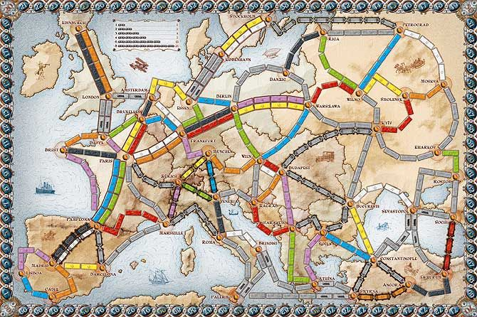

# Module to obtain minimum spanning tree of a graph.
Author : [jeanaymeric@gmail.com](mailto:jeanaymeric@gmail.com")

### I used the board game ___Les aventuriers du rail Europe___ to experiment with it.
The board game is published by [Days of wonder](https://www.daysofwonder.com/)


### Three algorithms are implemented :
- **Prim** with the function getPrimTree()
- **Kruskal** with the function getKruskalTree()
- **Boruvka** with the function getBoruvkaTree()

### There's also a function to calculate the weight of a graph : getTotalWeight()

All the function take a graph parameter.
It's an array of edges. Edge's constructed like this :
|**Key**|**Type**|Description|
|----|----|-|-|
|weight|string|The edge's weight |
|nodes |array |The 2 edge's nodes in string| |

Edge's example :
```
{
    "weight": <The edge's weight : number>,
    "nodes": [
        <The first edge's node : string>,
        <The second edge's node : string>
    ]
}
```
